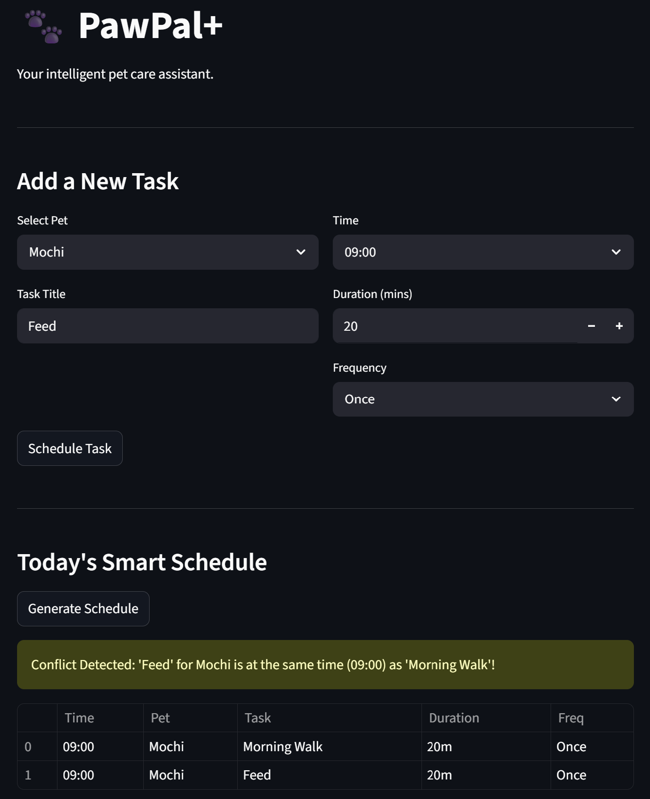

# PawPal+ (Module 2 Project)

You are building **PawPal+**, a Streamlit app that helps a pet owner plan care tasks for their pet.

## Scenario

A busy pet owner needs help staying consistent with pet care. They want an assistant that can:

- Track pet care tasks (walks, feeding, meds, enrichment, grooming, etc.)
- Consider constraints (time available, priority, owner preferences)
- Produce a daily plan and explain why it chose that plan

Your job is to design the system first (UML), then implement the logic in Python, then connect it to the Streamlit UI.

## What you will build

Your final app should:

- Let a user enter basic owner + pet info
- Let a user add/edit tasks (duration + priority at minimum)
- Generate a daily schedule/plan based on constraints and priorities
- Display the plan clearly (and ideally explain the reasoning)
- Include tests for the most important scheduling behaviors

## Getting started

### Setup

```bash
python -m venv .venv
source .venv/bin/activate  # Windows: .venv\Scripts\activate
pip install -r requirements.txt
```

### Suggested workflow

1. Read the scenario carefully and identify requirements and edge cases.
2. Draft a UML diagram (classes, attributes, methods, relationships).
3. Convert UML into Python class stubs (no logic yet).
4. Implement scheduling logic in small increments.
5. Add tests to verify key behaviors.
6. Connect your logic to the Streamlit UI in `app.py`.
7. Refine UML so it matches what you actually built.

## 🌟 Features (Smarter Scheduling)
- **Chronological Sorting:** Uses a custom lambda function to automatically sort all pet tasks by their time string ("HH:MM") so the daily plan flows logically.
- **Conflict Warnings:** The Scheduler algorithm detects and warns the user if two tasks across any pets are scheduled at the exact same start time.
- **Daily Recurrence Logic:** Built-in logic to handle repeating tasks, allowing daily routines to easily duplicate.

## 📸 Demo
<a href="pawpal_demo.png" target="_blank"></a>

## 🧪 Testing PawPal+
This project includes an automated test suite verifying the core object-oriented logic and scheduling algorithms.
- **Run the tests:** `python -m pytest`
- **Coverage:** The suite tests task completion, object addition, sorting accuracy, and conflict detection. 
- **Confidence Level:** ⭐⭐⭐⭐ (4/5 stars). The core logic is fully verified for standard use cases.